## AWS Cloud Engineer

**Greetings! We'll be going over the tasks for Week 3 - Days 2 of the Cloud Engineering program. Lets get started!**

## Week 3 - Day 2: Action Steps
* IAM Users
* IAM Groups
* IAM Roles
* IAM Policies
* MFA Best Practices
________________________

## IAM Users

Okay lets get started! Now I've never worked with AWS IAM before but I do have experience with Active Directory (AD) and privileges in general when it comes to an IT environment. I also have experience with creating Linux users so none of this seems too convoluted so far. The first task is to create a user with programmatic and/or console access and attach a policy. 

If your user has a password, it would be default have console access. If you create keys for you user, it will have programmatic access. So lets create a user with those credentials and a common policy attached. 

Navigate to the AWS IAM service and on the left hand blade, click IAM Users. Choose Create user. 

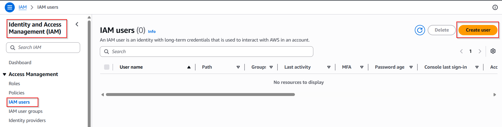

On the next page, you'll create the username and the option to allow console access. You'll need to create a password for that. 

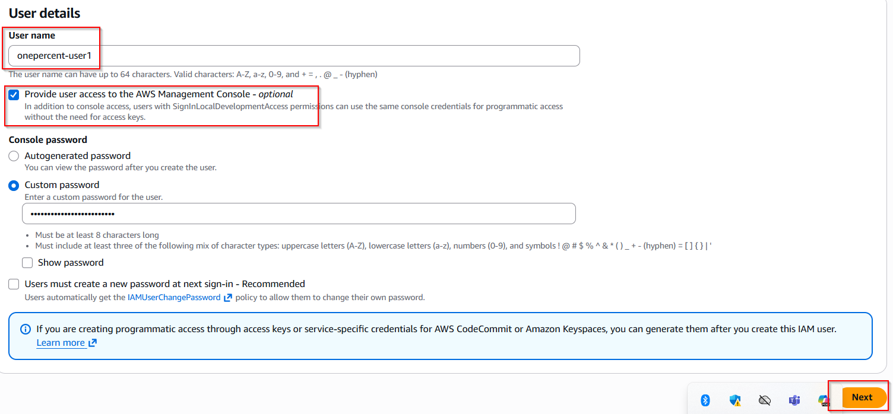

On the next page, you can set permissions. We're going to attach a pre-defined policy to the new user by choosing the option Apply policies directly. I chose the AdministratorAccess policy which is basically a most privileges policy (not a best practice). Click Next to continue.  

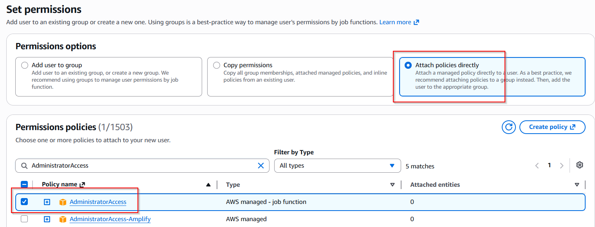

Review and create. Then, the new user should appear in the IAM Users tab.

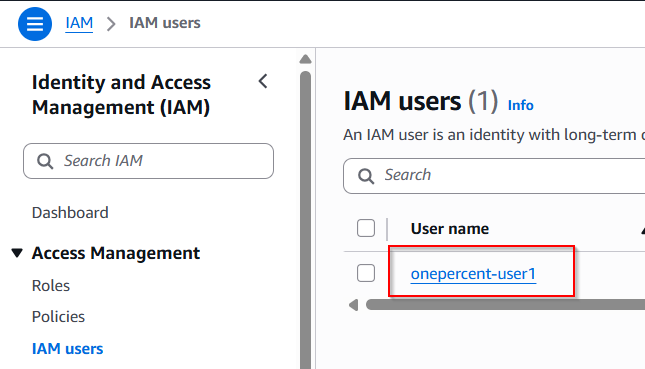

Now, lets create a group. 

## IAM Groups

We'll create a group named Admin and add the previous user to the group. Navigate to the IAM user groups tab and click Create group. 

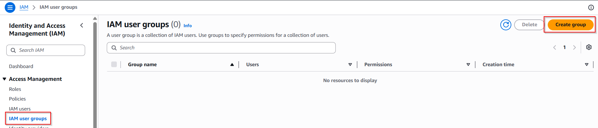

Once in the next part of the wizard, you can choose a name for the group, which users to add to the group, and which policies to add to the group. All users in the group will have this policy attached to them. 

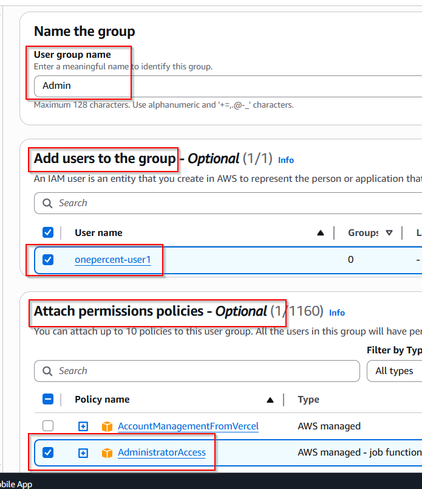

The next screen will show you that the group was created. Pretty straightforward. 

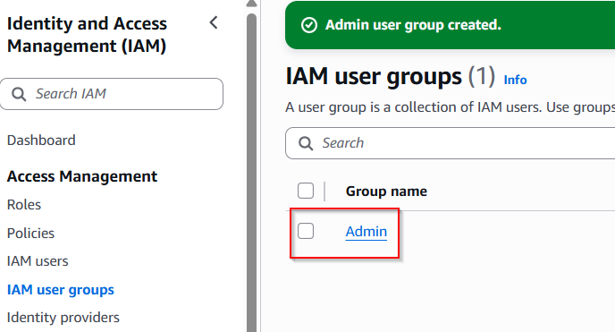

Lets make some roles!

## IAM Roles

You may be thinking what's the difference between a user and a role. A service can assume a role based on a policy which will define what access it has to other resources. So we attach roles to services and workloads instead of users. 

Navigate to the Roles tab and click Create role. 

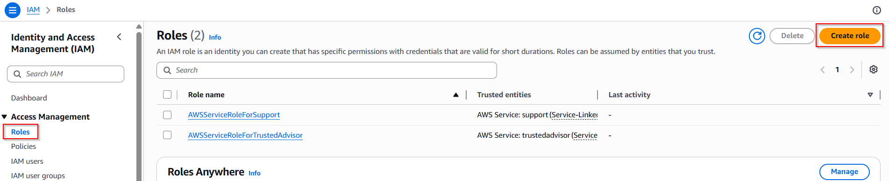

The next page allows us to choose which type of use we'll be applying the role to. We're choosing to appying the role to an AWS Service. In the next section, we see that we can apply the role to a specific service such as an EC2 instance. 

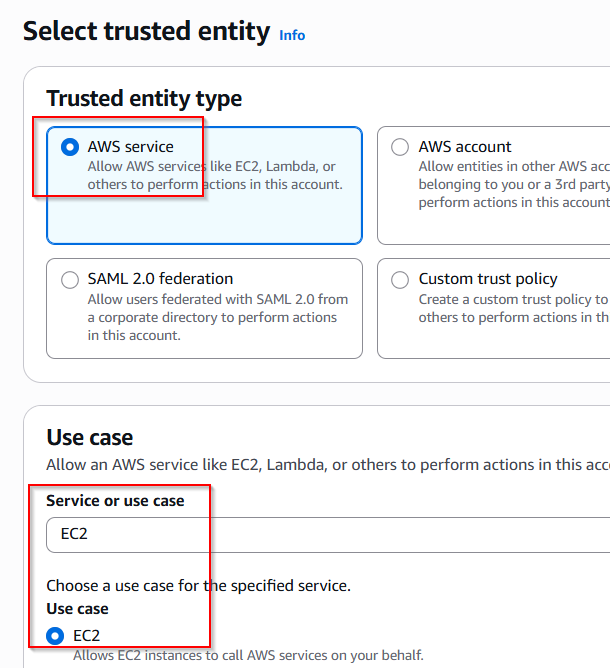

On the next page, you're able to specificy what that EC2 instance can do. We're allowing the EC2 instances to have Read Only access to the S3 service. 

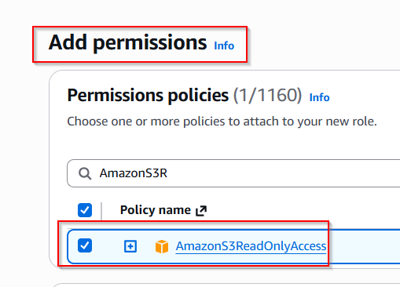

You can give your role a name and see the associated JSON structure that applies to your role. 

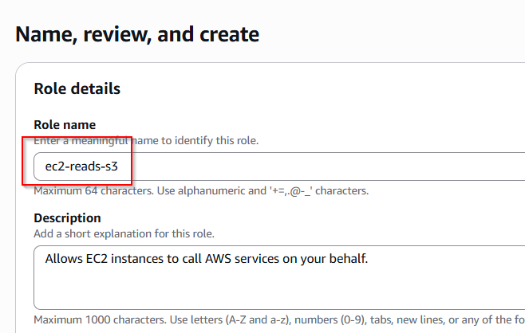

After you click create, the role should appear in the role list. 

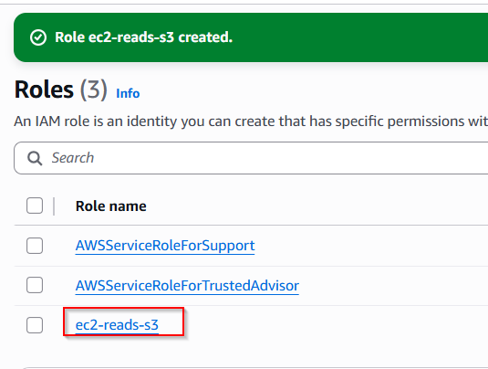

Lets move onto policies!

## IAM Policies

Lets create a custom policy. Navigate to Policies and click Create policy. 

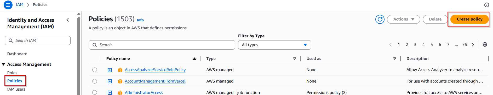

Here, you can get very granular with the policy that you're creating. You can choose the specific service that the policy is being applied to (what can other services do to THIS resource). They have list, read, write, and other options for this. 

Then, you can specify to permit or deny this access. You can also choose which specific services are allowed (or denied) to perform these actions to the destination resource. 

You can also create your own JSON template for this as well which would aid us in using Infrastructure as Code (IaC) to automate this process. 

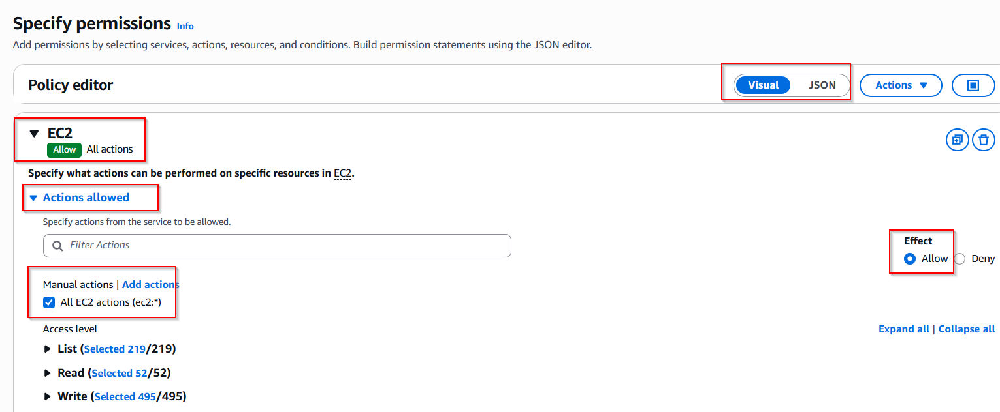

Give your policy a name and this page allows you to view the new policy guidelines that you created. 

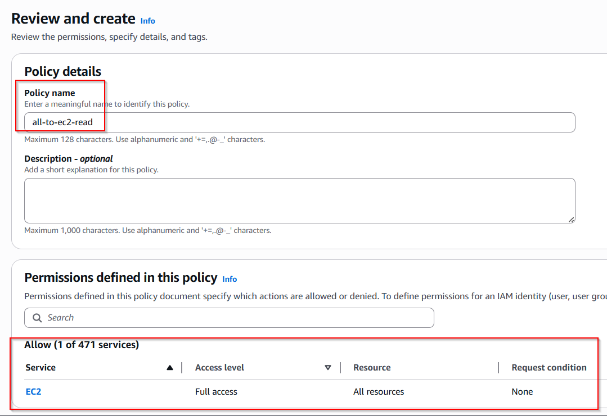

Navigate back to the Policies page and you'll see that your new policy was created! You may need to search for the name to filter out the other policies but it's there. Promise

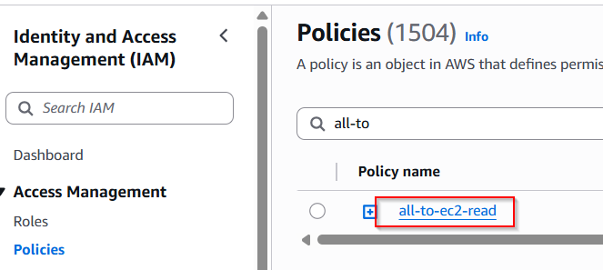

Last but not lease, MFA.

## MFA Best Practices

Now, I won't be going completely through this process because I don't want to set up an external device for MFA but I'll show you how to assign MFA to a user. Go to the user and navigate to the MFA section. You can click assign MFA device. 

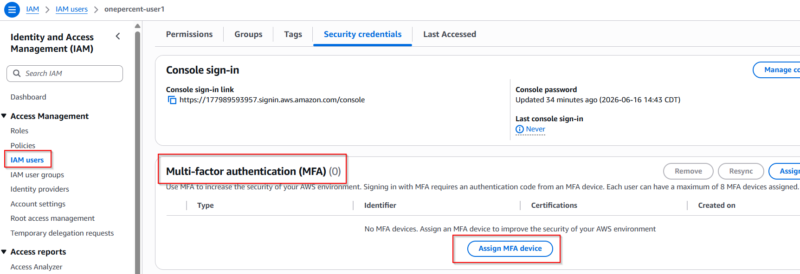

You can name your MFA profile and choose which option you'd like to authenticate using. I'm not going to assign a device right now.

In the past, I've used DUO, Okta and Microsoft Authenticator for MFA. There may be another one but I'm drawing a blank. I'm familiar with being the end user for MFA so all of this makes enough sense to me in order to continue. 

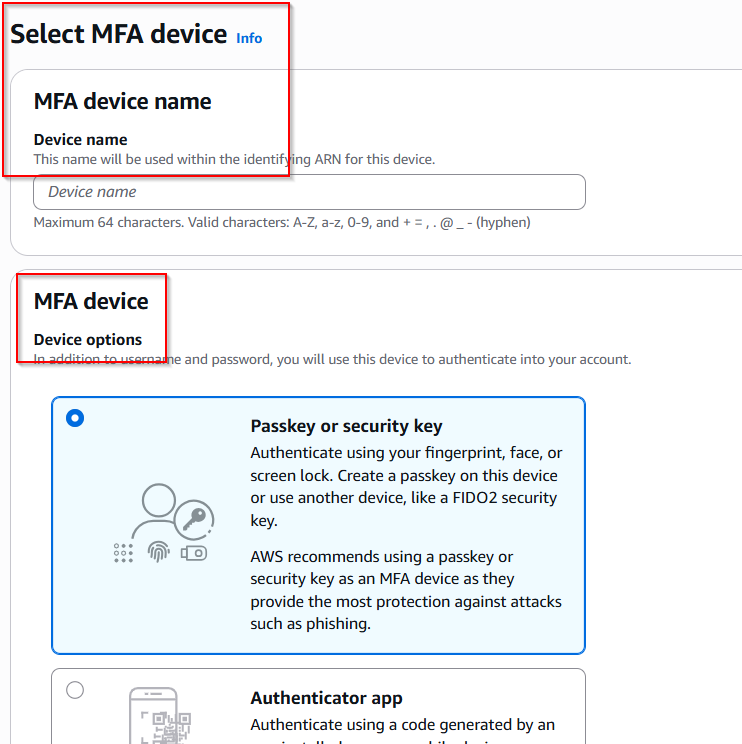

That completes our IAM lab!

## Personal Notes

This was really easy but I'm already familiar with these concepts. Thats for the eye opener though. 
